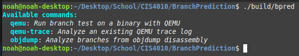
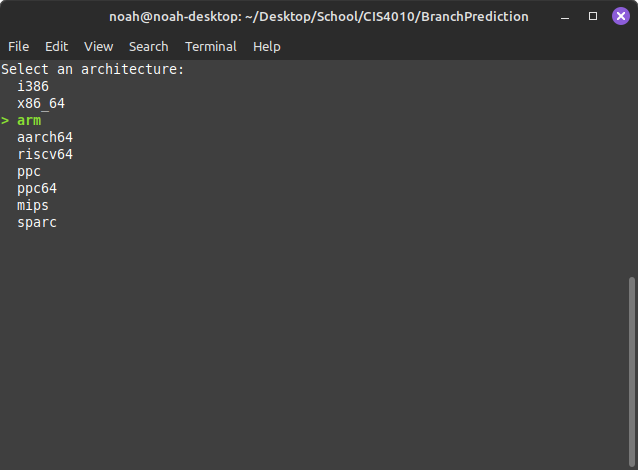

# NCLI: A Command-Line Interface Library for C++
NCLI is a lightweight and flexible C++ library for building interactive command-line interfaces (CLI) with support for options, flags, input handling, and color customization. It is designed to be easy to use while providing the flexibility to create powerful CLI applications.

## Features

* **Command and Option Handling:** Easily define commands with options and flags.
* **Interactive Input:** Supports list selection, checkboxes, and custom prompts.
* **Color and Style Support:** Output in terminal-friendly colors with options for bold, italic, and underlined text.
* **Cross-Platform:** Works on Unix-like systems (Linux, macOS) and Windows with support for common terminal features (in theory, might need some revision...)
* **Help and Documentation:** Auto-generated help messages for commands, options, and flags.

## Installation

**Option 1: Single-Header File:**

Simply include the `NCLI.h` header in your project and link with C++17 or higher.

```c++
#include "NCLI.h"
```

**Option 2: Build from source:**

1. Clone the repository
   ```sh
   git clone https://github.com/NoahGWood/NCLI.git
   ```

2. Build using CMake
   ```sh
   cd NCLI
   mkdir build && cd build
   cmake ..
   make
   ```

## Basic Usage

1. **Creating a Simple CLI Command**
   Here's a simple example that defines a command (greet) with options and flags.

   ```c++
   #include "NCLI.h"
   
   bool greet_command(const std::vector<NCLI::Flag>& flags, const std::vector<NCLI::Option>& options) {
       std::string name = "User";
       for (const auto& opt : options) {
           if (opt.Name == "name") {
               name = opt.Value;
           }
       }
   
       std::string greeting = "Hello, " + name + "!";
       if (std::find_if(flags.begin(), flags.end(), [](const NCLI::Flag& f) { return f.Name == "verbose"; }) != flags.end()) {
           greeting += " Welcome to the NCLI!";
       }
       std::cout << greeting << std::endl;
   }
   
   int main(int argc, char* argv[]) {
       NCLI::CLI cli;
   
       cli.command("greet", "Greet a user")
           .option("name", "Specify the user's name", "User")
           .flag("verbose", "Enable verbose output")
           .action(greet_command);
   
       cli.parse(argc, argv);
       cli.run();
       return true;
   }
   ```

2. **Adding Options & Flags**

   You can add options and flags to your command like so:
   ```c++
   cli.command("greet")
      .option("name", "Specify the user's name", "User")
      .flag("verbose", "Enabel verbose output");
   ```

   * **Options** are passed in the form `--option value` (e.g., `--name Bob`).
   * **Flags** are boolean switches passed in the form `-flag` (e.g., `-verbose`).

3. **Displaying Help Information**

   The library automatically generates help text output for each command, its options, and flags based on the help messages provided during setup. Running your binary without options returns the available commands:

   

   Providing a command with invalid flags or options will list the options and flags for that command (and, helpfully, show any flags/options that were set):

   

   

4. **Interactive Features (List & Checkbox)**

   You can prompt users for interactive input using `list()` and `checkbox()`:

   ```c++
   std::vector<std::string> options = {"Option 1", "Option 2", "Option 3"};
   std::string selected = NCLI::list("Select an option:", options);
   std::cout << "You selected: " << selected << std::endl;
   
   std::vector<std::string> flags = {"Flag 1", "Flag 2", "Flag 3"};
   std::set<std::string> selected_flags = NCLI::checkbox("Select flags:", flags);
   std::cout << "You selected: ";
   for (const auto& flag : selected_flags) {
       std::cout << flag << " ";
   }
   std::cout << std::endl;
   ```

   

   

5. **Hiding/Showing the Cursor**

   You can hide or show the terminal cursor during input to improve user experience:

   ```c++
   NCLI::hide_cursor();  // Hide cursor
   NCLI::show_cursor();  // Show cursor
   ```

## Color and Customization

The library uses ANSI escape codes to provide customizable colors and styles for your CLI output. Here are some examples:

* **Cyan Text**: `Color::cyan("text")`
* **Bold Text**: `Color::bold("text")`
* **Italic Text**: `Color::italic("text")`
* **Red Text**: `Color::red("text")`
* **Green Text**: `Color::green("text")`

You can combine them to apply multiple styles at once:

```c++
std::cout << Color::cyan(Color::bold("Important: ")) << Color::green("This is a highlighted message.") << std::endl;
```

## License

The license is generally permissible, see License.md for details.
